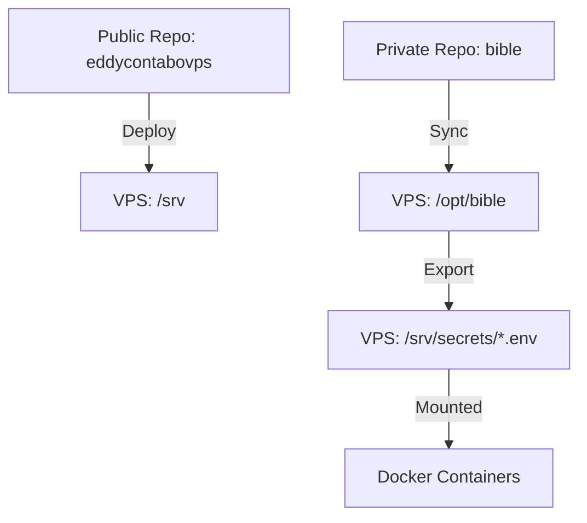

# Public/Private Secrets Model

This infrastructure follows a dual-repository model to allow public visibility of the primary codebase while keeping sensitive configurations private.

## Architecture



## Directory Structure (VPS)

- `/srv`: Working directory for the public repository.
- `/srv/secrets`: Secure directory (chmod 700) containing runtime `.env` files (chmod 600).
- `/opt/bible`: Local clone of the private secrets repository.

## How it works

1. **Continuous Deployment**: When code is pushed to `eddycontabovps`, GitHub Actions connects to the VPS.
2. **Secrets Synchronization**: The `sync_secrets.sh` script is executed. It uses `BIBLE_REPO_SSH_KEY` to pull the latest secrets from the `bible` repository.
3. **Environment Injection**: Secrets are copied from the bible repo to `/srv/secrets`.
4. **Application Restart**: Docker Compose picks up the updated `.env` files from `/srv/secrets/` as defined in `docker-compose.yml`.

## Adding a New Secret

1. Add the `.env` file to the `vps/` directory in the private **bible** repository.
2. In the public `docker-compose.yml`, update the `env_file` reference:
   ```yaml
   env_file: /srv/secrets/your-app.env
   ```
3. Commit and push both repositories. The CI will handle the rest.
